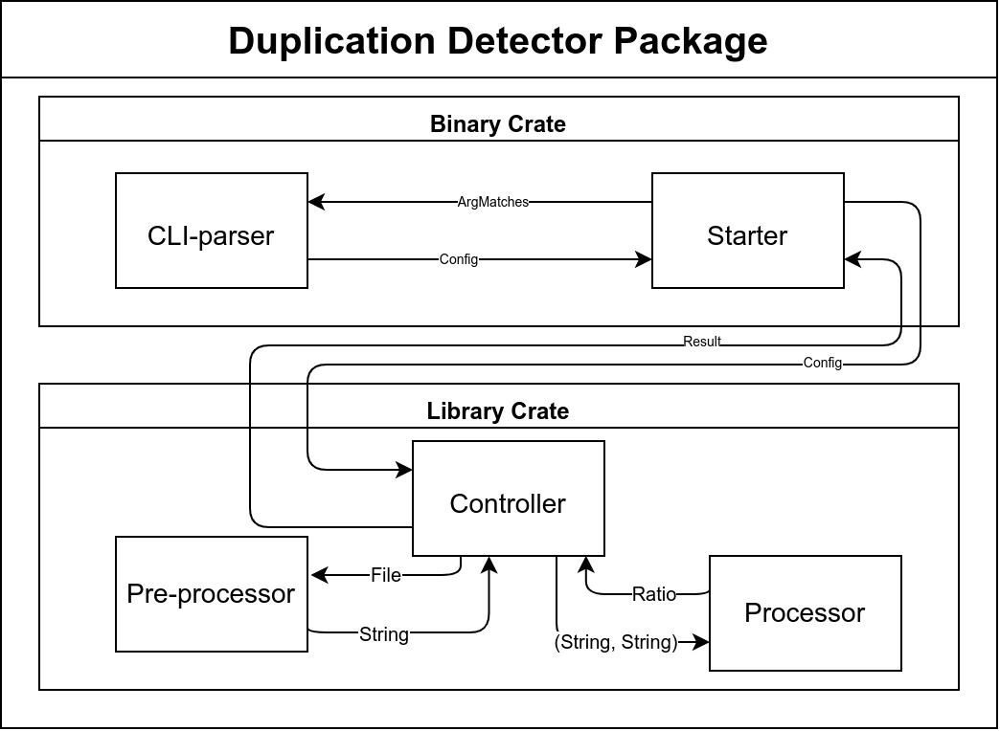

# Duplication Detector

A simple text file duplication (similarity) detector.

The course work of Software Engineering.

## Usage

`duplication-detector` is just a small course work, which is not recommended to use it in production environment.
Use it at your own risk.

The pre-built binary is available in [release page](https://github.com/PeterWang-dev/duplication-detector/releases).
You can download it and run it directly.

Linux and Windows of x86_64 are supported. Tested on ArchLinux and Windows 11.

This is a command line tool. You should run it in a terminal.
Provide the path of binary and the path of original file, input file and output file as arguments.
Detailed usage is shown below.

```bash
$ ./duplication-detector --help
A simple text file duplication (similarity) detector.
Test the duplication rate of the input file based on the original file. Output will be stored in a file which path is specified by the user.

Usage: duplication-detector <original_file> <input_file> <output_file>

Arguments:
  <original_file>  The path of reference file for duplication detector
  <input_file>     The path of input file
  <output_file>    The path where it stores the ratio of duplication

Options:
  -h, --help     Print help
  -V, --version  Print version
```

## Development

The project is developed in Rust.
The crate I used are listed below:

- [clap](https://crates.io/crates/clap) for command line argument parsing
- [textdistance](https://crates.io/crates/textdistance) for text similarity calculation

Moreover I used [criterion](https://crates.io/crates/criterion) for benchmarking,
which is only a dev-dependency.

### Architectural Design



The basic architecture of the project is shown above.

Dig into the details, the project is divided into 2 parts (crates):

- Binary crate: Used for command line argument parsing and error handling
- Library crate: core part of this `duplication-detector` ,
                  used for text similarity calculation.

If you want to know more about the concrete implementation,
you can refer to the [course report (in Chinese)](docs/README.md) or the source code.

### Compiling

Use latest stable Rust toolchain to compile the project.

```bash
$ cargo build
```

You can also use `--release` flag to compile the project in release mode,
which brings plenty of optimizations and makes the binary faster a lot.

```bash
$ cargo build --release
```

### Testing

A bench of unit tests are provided in the project.
`test/integration_test.rs` is the integration test, which tests the whole library.

`example/inputs` directory contains some example input files for testing.
DO NOT change the path of these files, or the integration test will fail.

```bash
$ cargo test
```

### Benchmarking

Benchmarking is done using [criterion](https://crates.io/crates/criterion).

Run the following command to benchmark the project.

```bash
$ cargo bench --bench criterion_benchmark
```

You may use `--verbose` flag to see more details.

```bash
$ cargo bench --bench criterion_benchmark -- --verbose
```
