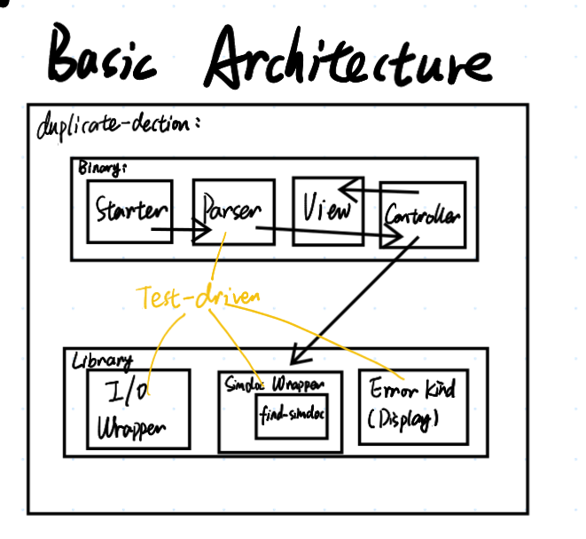

# 软件工程第二次作业——个人项目

| 这个作业属于哪个课程 | [软件工程](https://edu.cnblogs.com/campus/gdgy/CSGrade21-34)                                                                                                                                                                                                                                                                                                                                                                                                                                                                                                                                                                                                                                                                                                                                                                                                                                                                                                                                                                                                                                                                                                                                                                                                                                                                                                                                                                                                                                                                                                                                                                                                                                                                                                                                                                                                                                                                                                                                                                                                                                                                                                                                                                                                                                                                                                                                                                                                                                                                                                                                                                                                                                                                                                                                                                                                                                                                                                                                                                                                                                                                                                                                                                                                                                                                                                                                                                                               |
|----------------------|------------------------------------------------------------------------------------------------------------------------------------------------------------------------------------------------------------------------------------------------------------------------------------------------------------------------------------------------------------------------------------------------------------------------------------------------------------------------------------------------------------------------------------------------------------------------------------------------------------------------------------------------------------------------------------------------------------------------------------------------------------------------------------------------------------------------------------------------------------------------------------------------------------------------------------------------------------------------------------------------------------------------------------------------------------------------------------------------------------------------------------------------------------------------------------------------------------------------------------------------------------------------------------------------------------------------------------------------------------------------------------------------------------------------------------------------------------------------------------------------------------------------------------------------------------------------------------------------------------------------------------------------------------------------------------------------------------------------------------------------------------------------------------------------------------------------------------------------------------------------------------------------------------------------------------------------------------------------------------------------------------------------------------------------------------------------------------------------------------------------------------------------------------------------------------------------------------------------------------------------------------------------------------------------------------------------------------------------------------------------------------------------------------------------------------------------------------------------------------------------------------------------------------------------------------------------------------------------------------------------------------------------------------------------------------------------------------------------------------------------------------------------------------------------------------------------------------------------------------------------------------------------------------------------------------------------------------------------------------------------------------------------------------------------------------------------------------------------------------------------------------------------------------------------------------------------------------------------------------------------------------------------------------------------------------------------------------------------------------------------------------------------------------------------------------------------------------|
| 这个作业要求在哪里   | [个人项目](https://edu.cnblogs.com/campus/gdgy/CSGrade21-34/homework/13023)                                                                                                                                                                                                                                                                                                                                                                                                                                                                                                                                                                                                                                                                                                                                                                                                                                                                                                                                                                                                                                                                                                                                                                                                                                                                                                                                                                                                                                                                                                                                                                                                                                                                                                                                                                                                                                                                                                                                                                                                                                                                                                                                                                                                                                                                                                                                                                                                                                                                                                                                                                                                                                                                                                                                                                                                                                                                                                                                                                                                                                                                                                                                                                                                                                                                                                                                                                                |
| 这个作业的目标       | -   题目：论文查重      描述如下：      设计一个论文查重算法，给出一个原文文件和一个在这份原文上经过了增删改的抄袭版论文的文件，在答案文件中输出其重复率。      -   原文示例：今天是星期天，天气晴，今天晚上我要去看电影。     -   抄袭版示例：今天是周天，天气晴朗，我晚上要去看电影。      要求输入输出采用文件输入输出，规范如下：      -   从命令行参数给出：论文原文的文件的绝对路径。     -   从命令行参数给出：抄袭版论文的文件的绝对路径。     -   从命令行参数给出：输出的答案文件的绝对路径。      我们提供一份样例，课堂上下发，上传到班级群，使用方法是：orig.txt是原文，其他orig_add.txt等均为抄袭版论文。      注意：答案文件中输出的答案为浮点型，精确到小数点后两位。  -   评分标准：      -   博客评分规则：总分60分：          1.  在Github仓库中新建一个学号为名的文件夹，同时在博客正文首行给出作业github链接。（3'）         2.  在开始实现程序之前，在下述PSP表格记录下你估计将在程序的各个模块的开发上耗费的时间。（6'）         3.  计算模块接口的设计与实现过程。设计包括代码如何组织，比如会有几个类，几个函数，他们之间关系如何，关键函数是否需要画出流程图？说明你的算法的关键（不必列出源代码），以及独到之处。（18'）         4.  计算模块接口部分的性能改进。记录在改进计算模块性能上所花费的时间，描述你改进的思路，并展示一张性能分析图（由VS 2017/JProfiler的性能分析工具自动生成），并展示你程序中消耗最大的函数。（12'）         5.  计算模块部分单元测试展示。展示出项目部分单元测试代码，并说明测试的函数，构造测试数据的思路。并将单元测试得到的测试覆盖率截图，发表在博客中。（12'）         6.  计算模块部分异常处理说明。在博客中详细介绍每种异常的设计目标。每种异常都要选择一个单元测试样例发布在博客中，并指明错误对应的场景。（6'）         7.  在你实现完程序之后，在附录提供的PSP表格记录下你在程序的各个模块上实际花费的时间。（3'）      -   程序评分规则：         总分40分，程序评分是根据代码质量综合考量给出的评分，主要考察如下方面：          1.  算法的性能（耗费的时间、占用的系统资源、准确度等）（20'）         2.  代码的可读性（至少要有点注释吧？）（10'）         3.  变量、函数、类命名的规范化（10'）          程序按照传递命令行参数的方式提供文件的位置，您的提交的作业程序需要从指定的位置读取文件，并向指定的文件输出答案：          -   Python: python main.py [原文文件] [抄袭版论文的文件] [答案文件]         -   C: main.exe [原文文件] [抄袭版论文的文件] [答案文件]         -   Java: java -jar main.jar [原文文件] [抄袭版论文的文件] [答案文件]          保证每个参数以空格隔开，文件路径中不含有空格，例如：          `java -jar main.jar C:\tests\org.txt C:\tests\org_add.txt C:\tests\ans.txt`          ——至于如何在程序里接受命令行参数可以去搜索一下          Python需要将入口文件名设置成main.py，C/C++需要提供可执行文件main.exe，Java需要提供编译好的jar包main.jar          一共有18个测试点（不含样例），测试作为评判功能是否正常的依据，全过就没问题，不过要扣分。          如遇到下列情况之一，当前测试点将不能通过，对于每个不能通过的测试点从程序评分中扣2分：          -   程序内存泄漏严重         -   5秒内未给出答案         -   占用的内存超过2048MB         -   发生异常退出          凡提交的可执行文件、出现下列情况之一者，作业以0分计：          -   尝试连接网络         -   尝试读写其他文件         -   尝试妨碍评测——例如: system("shutdown") |

## 需求分析

### MoSCoW 方法

#### Must have

-   [] CLI 界面及操作：
    从命令行参数给出原文文本路径、检查文本路径、答案路径
-   [] 文件输入输出
-   [] 精度保留到小数点后两位

#### Should have

-   [] 速度要求：5秒内给出答案
-   [] 内存要求：占用内存不超过2048MB
-   [] 异常处理：异常退出时，输出异常信息
-   [] 单元测试：单元测试代码，测试覆盖率截图
-   [] 性能分析：性能分析图

#### Could have

-   [] 日志系统
-   [] 全功能 CLI 界面支持

#### Won't have

未提到的其他功能

### Personal Software Process

| PSP2.1                                     |   Personal Software Process Stages         |   预估耗时（分钟）  |   实际耗时（分钟）  |
|--------------------------------------------|--------------------------------------------|---------------------|---------------------|
|   Planning                                 |   计划                                     |     120             |                     |
|   · Estimate                               |   · 估计这个任务需要多少时间               |     120             |                     |
|   Development                              |   开发                                     |     1170            |                     |
|   · Analysis                               |   · 需求分析 (包括学习新技术)              |     300             |                     |
|   · Design Spec                            |   · 生成设计文档                           |     180             |                     |
|   · Design Review                          |   · 设计复审                               |     30              |                     |
|   · Coding Standard                        |   · 代码规范 (为目前的开发制定合适的规范)  |     30              |                     |
|   · Design                                 |   · 具体设计                               |     240             |                     |
|   · Coding                                 |   · 具体编码                               |     240             |                     |
|   · Code Review                            |   · 代码复审                               |     60              |                     |
|   · Test                                   |   · 测试（自我测试，修改代码，提交修改）   |     90              |                     |
|   Reporting                                |   报告                                     |     210             |                     |
|   · Test Repor                             |   · 测试报告                               |     90              |                     |
|   · Size Measurement                       |   · 计算工作量                             |     90              |                     |
|   · Postmortem & Process Improvement Plan  |   · 事后总结, 并提出过程改进计划           |     30              |                     |
|                                            |   · 合计                                   |    1500             |                     |

## 架构设计

## 实现过程

### Test Driven Development

## 单元测试

## 性能测试
