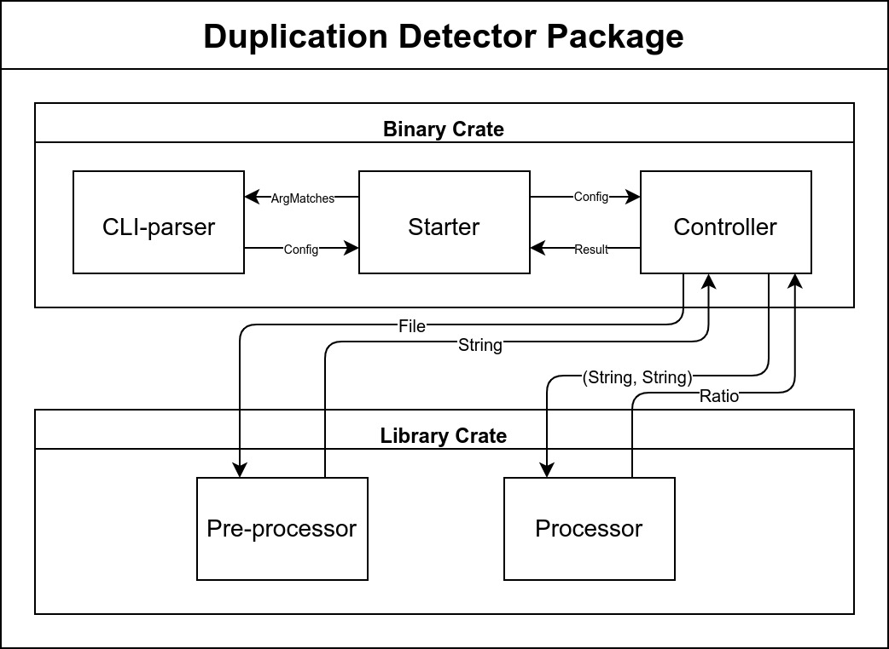
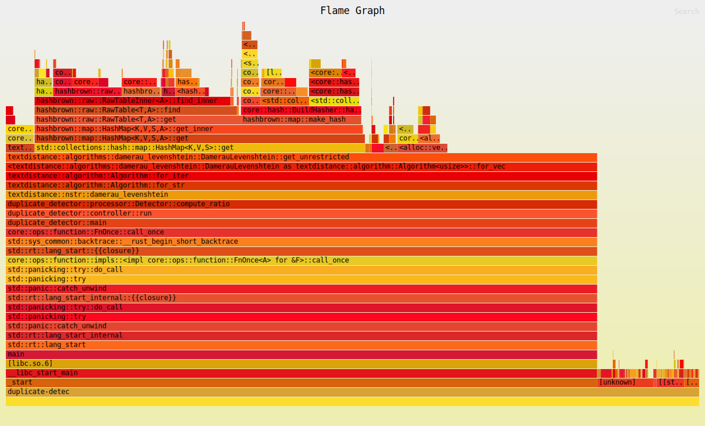
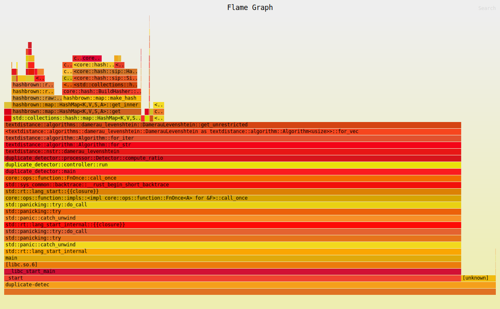

# 软件工程第二次作业——个人项目

| 这个作业属于哪个课程 | [软件工程](https://edu.cnblogs.com/campus/gdgy/CSGrade21-34)                                                                                                                                                                                                                                                                                                                                                                                                                                                                                                                                                                                                                                                                                                                                                                                                                                                                                                                                                                                                                                                                                                                                                                                                                                                                                                                                                                                                                                                                                                                                                                                                                                                                                                                                                                                                                                                                                                                                                                                                                                                                                                                                                                                                                                                                                                                                                                                                                                                                                                                                                                                                                                                                                                                                                                                                                                                                                                                                                                                                                                                                                                                   |
|----------------------|--------------------------------------------------------------------------------------------------------------------------------------------------------------------------------------------------------------------------------------------------------------------------------------------------------------------------------------------------------------------------------------------------------------------------------------------------------------------------------------------------------------------------------------------------------------------------------------------------------------------------------------------------------------------------------------------------------------------------------------------------------------------------------------------------------------------------------------------------------------------------------------------------------------------------------------------------------------------------------------------------------------------------------------------------------------------------------------------------------------------------------------------------------------------------------------------------------------------------------------------------------------------------------------------------------------------------------------------------------------------------------------------------------------------------------------------------------------------------------------------------------------------------------------------------------------------------------------------------------------------------------------------------------------------------------------------------------------------------------------------------------------------------------------------------------------------------------------------------------------------------------------------------------------------------------------------------------------------------------------------------------------------------------------------------------------------------------------------------------------------------------------------------------------------------------------------------------------------------------------------------------------------------------------------------------------------------------------------------------------------------------------------------------------------------------------------------------------------------------------------------------------------------------------------------------------------------------------------------------------------------------------------------------------------------------------------------------------------------------------------------------------------------------------------------------------------------------------------------------------------------------------------------------------------------------------------------------------------------------------------------------------------------------------------------------------------------------------------------------------------------------------------------------------------------------|
| 这个作业要求在哪里   | [个人项目](https://edu.cnblogs.com/campus/gdgy/CSGrade21-34/homework/13023)                                                                                                                                                                                                                                                                                                                                                                                                                                                                                                                                                                                                                                                                                                                                                                                                                                                                                                                                                                                                                                                                                                                                                                                                                                                                                                                                                                                                                                                                                                                                                                                                                                                                                                                                                                                                                                                                                                                                                                                                                                                                                                                                                                                                                                                                                                                                                                                                                                                                                                                                                                                                                                                                                                                                                                                                                                                                                                                                                                                                                                                                                                    |
| 这个作业的目标       | \- 题目：论文查重   描述如下：   设计一个论文查重算法，给出一个原文文件和一个在这份原文上经过了增删改的抄袭版论文的文件，在答案文件中输出其重复率。   - 原文示例：今天是星期天，天气晴，今天晚上我要去看电影。  - 抄袭版示例：今天是周天，天气晴朗，我晚上要去看电影。   要求输入输出采用文件输入输出，规范如下：   - 从命令行参数给出：论文原文的文件的绝对路径。  - 从命令行参数给出：抄袭版论文的文件的绝对路径。  - 从命令行参数给出：输出的答案文件的绝对路径。   我们提供一份样例，课堂上下发，上传到班级群，使用方法是：orig.txt是原文，其他orig_add.txt等均为抄袭版论文。   注意：答案文件中输出的答案为浮点型，精确到小数点后两位。  - 评分标准：   - 博客评分规则：总分60分：   1. 在Github仓库中新建一个学号为名的文件夹，同时在博客正文首行给出作业github链接。（3’）  2. 在开始实现程序之前，在下述PSP表格记录下你估计将在程序的各个模块的开发上耗费的时间。（6’）  3. 计算模块接口的设计与实现过程。设计包括代码如何组织，比如会有几个类，几个函数，他们之间关系如何，关键函数是否需要画出流程图？说明你的算法的关键（不必列出源代码），以及独到之处。（18’）  4. 计算模块接口部分的性能改进。记录在改进计算模块性能上所花费的时间，描述你改进的思路，并展示一张性能分析图（由VS 2017/JProfiler的性能分析工具自动生成），并展示你程序中消耗最大的函数。（12’）  5. 计算模块部分单元测试展示。展示出项目部分单元测试代码，并说明测试的函数，构造测试数据的思路。并将单元测试得到的测试覆盖率截图，发表在博客中。（12’）  6. 计算模块部分异常处理说明。在博客中详细介绍每种异常的设计目标。每种异常都要选择一个单元测试样例发布在博客中，并指明错误对应的场景。（6’）  7. 在你实现完程序之后，在附录提供的PSP表格记录下你在程序的各个模块上实际花费的时间。（3’）   - 程序评分规则：  总分40分，程序评分是根据代码质量综合考量给出的评分，主要考察如下方面：   1. 算法的性能（耗费的时间、占用的系统资源、准确度等）（20’）  2. 代码的可读性（至少要有点注释吧？）（10’）  3. 变量、函数、类命名的规范化（10’）   程序按照传递命令行参数的方式提供文件的位置，您的提交的作业程序需要从指定的位置读取文件，并向指定的文件输出答案：   - Python: python main.py \[原文文件\] \[抄袭版论文的文件\] \[答案文件\]  - C: main.exe \[原文文件\] \[抄袭版论文的文件\] \[答案文件\]  - Java: java -jar main.jar \[原文文件\] \[抄袭版论文的文件\] \[答案文件\]   保证每个参数以空格隔开，文件路径中不含有空格，例如：   `java -jar main.jar C:\tests\org.txt C:\tests\org_add.txt C:\tests\ans.txt`   ——至于如何在程序里接受命令行参数可以去搜索一下   Python需要将入口文件名设置成main.py，C/C++需要提供可执行文件main.exe，Java需要提供编译好的jar包main.jar   一共有18个测试点（不含样例），测试作为评判功能是否正常的依据，全过就没问题，不过要扣分。   如遇到下列情况之一，当前测试点将不能通过，对于每个不能通过的测试点从程序评分中扣2分：   - 程序内存泄漏严重  - 5秒内未给出答案  - 占用的内存超过2048MB  - 发生异常退出   凡提交的可执行文件、出现下列情况之一者，作业以0分计：   - 尝试连接网络  - 尝试读写其他文件  - 尝试妨碍评测——例如: system(“shutdown”) |

# 需求分析

在进行项目程序设计前，首先需要对题目进行需求分析，明确项目的功能需求，以及对应的性能需求。

在个人项目的开发中，我选择使用 **MoSCoW 方法** 进行需求分析。

## MoSCoW 方法

MoSCoW 方法是一种需求分析方法，它将需求分为 **四类** ： **必须（Must
have）** 、 **应该（Should have）** 、 **可以（Could have）** 、
**不会有（Won’t have）** 。

通过对需求进行分类，从而确定实现的优先级，使得开发过程有目标，更加高效。

### Must have

- [x] 基本功能——文本查重：输入两文本文件，输出重复率
  - [x] CLI
    界面及操作：从命令行参数给出原文文本路径、检查文本路径、答案路径
  - [x] 文件输入输出
  - [x] 精度要求：保留到小数点后两位

### Should have

- [x] 性能指标
  - [x] 速度要求：5秒内给出答案
  - [x] 内存要求：占用内存不超过2048MB
- [x] 异常处理：异常退出时，能够输出可读的异常信息
- [x] 单元测试：对模块进行单元测试，尽可能覆盖所有情况，保证程序正确性
- [x] 性能分析：通过性能分析工具，分析性能瓶颈

### Could have

- [x] 全功能 CLI
  界面支持：使用通用方法解析命令行参数，支持扩展多种参数格式，支持帮助信息
- [ ]
  多语言支持：支持多种语言的重复率计算，如中文、英文等，支持混合语言文本输入
- [ ]
  日志系统：向用户提供运行时信息，并集成至操作系统日志系统，方便用户查看

### Won’t have

未提到的其他功能，如图形界面、网络服务等。

# 整体设计

需求分析后，还要对项目程序进行整体设计，而后再进行具体实现，增强开发效率。
将架构设计分为前期信息搜集、确定技术指标、划分功能模块、设计程序架构这四个步骤。

## 前期信息搜集

首先明确基本功能，然后围绕其自由搜集相关信息，对设计目标有一个整体的感知。

具体到这次个人项目，我在前期信息搜集中围绕文本查重这一基本功能，搜集关于文本查重的相关算法。
同时，根据项目的性能指标特点，选择合适的实现工具，如编程语言、代码库等。

## 确定技术指标

在前期信息搜集的基础上，确定项目的技术指标，如编程语言、处理算法、使用库、代码规范等。

在本次个人项目中，我确定的技术指标如下：

- 开发语言： Rust （代码规范使用 Rust RFC 规范）
- 平台支持： Windows 、 Linux
- 文本查重算法：基于编辑距离（最终采用）、向量空间模型或基于哈希的查重算法
- 可能使用的库（ crate ）： `simhash` 、 `find-simdoc` 、 `textdistance`
  （最终采用）

> **为什么选择 Rust 作为开发语言？**
>
> 因为 Rust 作为一种编译型语言，相比 Python 、 Java
> 等（半）解释型语言，具有更高的性能。 同时，Rust 相比 C++
> 在编译时进行内存安全检查，避免了 C++ 中常见的内存安全问题。 Cargo 作为
> Rust 的包管理工具，提供了便捷的依赖库管理、单元测试、文档生成等功能，
> 使得 Rust 语言的开发更加高效，更加适合做项目开发。
>
> 然而，作为一个新兴的语言，Rust 的生态并不如 Python
> 那么丰富，稳定性和质量不如 Java ， 这是使用 Rust
> 开发所遇到的最大问题。比如，Python 中的自然语言处理包 `nltk` ， 在
> Rust 中并没有质量相当的 crate （ Rust
> 的包），很多时候需要自己“写轮子”。 部分 Rust 初学者也有反馈，Rust
> 的学习曲线较陡， 需要对计算机底层有相当深刻的理解，上手难度较大。
>
> 经过利弊的权衡，我还是选择了 Rust 作为开发语言，因为我认为 Rust
> 的优势更加突出，
> 其优秀的基础设施建设给开发带来了极大的便利，同时语言本身有完整的编码规范与
> IO 程序设计范式， 很适合类似本项目的开发。
>
> **为什么支持 Windows 和 Linux 两个平台？**
>
> 这里就要感谢 Rust 的优秀的标准库设计了。Rust
> 的标准库提供了跨平台的接口，
> 若程序中仅使用标准库，那么程序经过交叉编译或直接在对象平台编译后，就可以运行。
>
> Linux 作为我常用的开发平台，对其支持是必要的。 而且在 Linux 开发相比
> Windows 更加方便，虽然会带来诸如交叉编译之类的项目无关问题， 但这个 “
> trade-off ”在我看来是可接受的。
>
> **为什么最终采用了 `textdistance` 中的基于编辑距离的查重算法？**
>
> 因为 `textdistance`
> 作为一个老牌的文本相似度计算库，其算法经过了长期的优化，
> 比自己手写实现的算法更加稳定，更加准确，而且能大大提升开发效率——从手写查重算法到调包。
> 要上生产的工具不管是不是亲手实现的，最重要的始终是稳定性。有高稳定性的包，为什么不用呢？
>
> 选择基于编辑距离的算法，是因为其接口容易调用，而且准确度较高。
> 然而这种算法也带来了较大的时间开销，由于开发周期短，我没有时间去研究何种算法最优，
> 而该算法经过编译期优化后，已经可以满足项目的性能指标要求，所以最终选择了该算法。
> 不过这确实是一个需要改进的地方，后续可以考虑使用其他算法，如基于哈希的算法。

## 划分功能模块

根据 Rust
程序的[编码规范](https://rust-lang.github.io/api-guidelines/checklist.html)
与 [IO
程序设计范式](https://doc.rust-lang.org/stable/book/ch12-00-an-io-project.html)，
将程序划分为一个可执行的 binary crate 和一个库 library crate 。

两个 crate 的功能又可以细化为多个模块，如下：

- binary crate：
  - `main.rs` ：程序入口，负责初始化相关模块、处理异常并返回给操作系统
  - `cli_parser.rs` ：命令行参数解析模块，负责解析命令行参数，生成库配置
  - `controller.rs`
    ：控制器模块，负责控制程序的运行流程，调用库函数，传递程序异常
- library crate：
  - `lib.rs` ：库入口，负责结构化整个库的模块（建立模块树），建立库配置
  - `preprocessor.rs`
    ：预处理模块，负责对文本进行预处理，去除空行，将文件读入字符串
  - `processor.rs` ：处理模块，负责调用 `textdistance`
    库，计算文本相似度

> **实际上，这一部分是事后复盘才能写的如此清晰。**
> 说实话，很难在开发初期，未经实践的情况下，就能够准确地划分模块。
> 开发过程中是先根据预先设定的架构进行开发，开发不动的时候考虑进行重构。
> 要承认的是这种开发方法在起初会发生大量重构，目前为止我没有找到合适的方法来解决这个问题。

## 设计程序架构

根据程序的功能划分，设计程序的架构，确定模块之间的关系，以及模块内部的结构。

整体架构图如下：

<figure>

<figcaption aria-hidden="true">设计架构图（ Duplication Dector v0.2.0
）</figcaption>
</figure>

# 实现过程

由于本次开发周期短，因而使用 Rust 推荐的敏捷开发方法——测试驱动开发 （
Test Driven Development, TDD ）。

## Test Driven Development

首先编写单元测试，测试用例覆盖所有情况，然后编写代码，使得测试用例通过。

单元测试从外向内编写，逐层细化，直到最底层的函数。
首先编写最外层的综合测试 `integration_test::test_full_functionalities`
（注意，本文行文过程中会使用 Rust 相关记号，便于描述思路），
测试整个程序的功能是否正常，然后根据综合测试的流程，开发各个模块。

进入各个模块的开发后也是先写该模块的单元测试，边写测试边明确 API 设计，
然后再编写代码，使得测试通过。这样做可以大大加速开发效率，同时保证代码质量。
因为这样开发基本能做到单元测试覆盖到每一个函数，开发也有目的性而不会失去方向。

## 各 module 的 API 列表

| 各 module 的 API 列表                                                                                                                                                                                                                                                                                                                                                            |
|----------------------------------------------------------------------------------------------------------------------------------------------------------------------------------------------------------------------------------------------------------------------------------------------------------------------------------------------------------------------------------|
| main.rs: + main(): 程序入口，传递参数，异常处理                                                                                                                                                                                                                                                                                                                               |
| cli_parser.rs: + to_config(): 解析命令行参数为库配置                                                                                                                                                                                                                                                                                                                          |
| controller.rs: + run(): 程序逻辑，调用库函数，传递异常                                                                                                                                                                                                                                                                                                                        |
| lib.rs: + Config: 库配置，结构化存储库需要的外部参数 + original_path(): 获取源文件路径 + input_path(): 获取输入文件路径 + output_path(): 获取输出文件路径                                                                                                                                                                                                            |
| preprocessor.rs: + trim_and_convert(): 读取文件，输出去除了空行的字符串                                                                                                                                                                                                                                                                                                       |
| processor.rs: + Detector: 检查器，存储输入输出，计算重复率 + new(): 构造器 + original_string(): 获取源字符串 + input_string(): 获取输入字符串 + duplicate_ratio(): 获取输出重复率 + set_original_string(): 设置源字符串 + set_input_string(): 设置输入字符串 - from_result_to_ratio(): 将 textdistance 输出转换为重复率 + compute_ratio(): 计算重复率 |
| main.rs: + main(): 程序入口，传递参数，异常处理                                                                                                                                                                                                                                                                                                                               |
| cli_parser.rs: + to_config(): 解析命令行参数为库配置                                                                                                                                                                                                                                                                                                                          |
| controller.rs: + run(): 程序逻辑，调用库函数，传递异常                                                                                                                                                                                                                                                                                                                        |
| lib.rs: + Config: 库配置，结构化存储库需要的外部参数 + original_path(): 获取源文件路径 + input_path(): 获取输入文件路径 + output_path(): 获取输出文件路径                                                                                                                                                                                                            |
| preprocessor.rs: + trim_and_convert(): 读取文件，输出去除了空行的字符串                                                                                                                                                                                                                                                                                                       |
| processor.rs: + Detector: 检查器，存储输入输出，计算重复率 + new(): 构造器 + original_string(): 获取源字符串 + input_string(): 获取输入字符串 + duplicate_ratio(): 获取输出重复率 + set_original_string(): 设置源字符串 + set_input_string(): 设置输入字符串 - from_result_to_ratio(): 将 textdistance 输出转换为重复率 + compute_ratio(): 计算重复率 |

# 程序评估

接下来将进行程序评估。

评估包含两个维度： **单元测试** 与 **性能热力图**

## 单元测试

程序中使用的单元测试是结构化的，大致如下：

- `integration_test` ：库综合测试
  - `test_full_functionalities`：测试库整体是否能够正常运行
  - `test_with_example_inputs`：测试库是否能够正常处理样例输入
- `cli_parser` ：binary crate 命令行参数解析模块单元测试
  - `test_to_config`：测试命令行参数解析是否正确
- `lib` ： library crate 单元测试（测试 `Config` 结构体及其方法）
  - `test_config_from`：测试 `Config` 结构体是否能正常构建
  - `test_config_getter`：测试 `Config` 结构体的获取方法（ getter
    ）是否正常
- `preprocessor` ：预处理模块单元测试
  - `test_trim_and_convert`：测试预处理模块是否能够正常转换文件
- `processor` ：处理模块单元测试
  - `test_detector_new` ：测试处理模块是否能够正常构建
  - `test_detector_getter` ：测试处理模块的获取方法（ getter ）是否正常
  - `test_detector_setter` ： 测试处理模块的设置方法（ setter ）是否正常
  - `test_detector_compute_ratio_partial_similar`
    ：测试处理模块是否能够计算部分相似的文本重复率
  - `test_detector_compute_ratio_not_similar`
    ：测试处理模块是否能够计算完全不相似的文本重复率
  - `test_detector_compute_ratio_almost_same`
    ：测试处理模块是否能够计算几乎相同的文本重复率

单元测试基本覆盖了库内所有方法。

对于可执行程序，单元测试只覆盖了 `cli_parser`
模块，因为其他模块都是二进制程序的直接组成部分，
如果出错，可执行程序就无法正常运行。

## 性能热力图

由于 Rust 的生态暂时不是很完善，性能分析工具不是很多。这里使用了
[flamegraph](https://github.com/flamegraph-rs/flamegraph)
作为生成热力图的工具。

`flamegraph` 后端使用 `perf` ，因此需要在 Linux 环境下运行（Windows
下需要等待 Dtrace 进入内核）。 使用 `cargo` 的子命令 `cargo flamegraph`
启动性能分析。

测试编译器优化前（ `[unoptimized + debuginfo]`
）下的执行时间和热力图如下：

<figure>

<figcaption aria-hidden="true">执行时间为 37s 的热力图</figcaption>
</figure>

测试编译器优化后（ `[optimized + debuginfo]`
）下的执行时间和热力图如下：

<figure>

<figcaption aria-hidden="true">执行时间为 4s 的热力图</figcaption>
</figure>

从热力图可以看到，性能瓶颈主要在 `textdistance` 库的
`damerau_levenshtein` 函数上，
这是因为该函数是基于编辑距离的算法，时间复杂度相对较高，可以通过更换查重算法来解决。

不过，这里并没有采用更换算法的方法。幸运的是，编译器帮我们解决了问题。

继续分析热力图，可以看到，`textdistance` 库的 `damerau_levenshtein`
函数中， 大量的时间开销都在 `std::collections::hash_map::HashMap::get`
函数上。 而通过应用 `[release]`
的编译参数，可以看到，这个函数的时间开销大大降低了。
准确来讲，经过编译器对发行版本的代码优化，哈希表查找更换了具体实现方式，从而大大降低了时间开销。

虽然通过编译器优化满足了性能指标，但是必须要承认这种优化的效果是有限的，最佳方案仍是更换算法。
由于开发周期短，所以没有时间对所有算法进行测试，因此最终采用了
`textdistance` 库中的算法。

# 个人软件开发流程 Personal Software Process

软件的整体开发过程通过 PSP2.1
进行规划和记录，从而便于对软件开发过程进行复盘和优化。

| PSP2.1                                  | Personal Software Process Stages        | 预估耗时（分钟） | 实际耗时（分钟） |
|-----------------------------------------|-----------------------------------------|------------------|------------------|
| Planning                                | 计划                                    | 120              | 60               |
| · Estimate                              | · 估计这个任务需要多少时间              | 120              | 60               |
| Development                             | 开发                                    | 1170             | 1065             |
| · Analysis                              | · 需求分析 (包括学习新技术)             | 300              | 300              |
| · Design Spec                           | · 生成设计文档                          | 180              | 180              |
| · Design Review                         | · 设计复审                              | 30               | 30               |
| · Coding Standard                       | · 代码规范 (为目前的开发制定合适的规范) | 30               | 0                |
| · Design                                | · 具体设计                              | 240              | 180              |
| · Coding                                | · 具体编码                              | 240              | 300              |
| · Code Review                           | · 代码复审                              | 60               | 15               |
| · Test                                  | · 测试（自我测试，修改代码，提交修改）  | 90               | 60               |
| Reporting                               | 报告                                    | 210              | 180              |
| · Test Repor                            | · 测试报告                              | 90               | 60               |
| · Size Measurement                      | · 计算工作量                            | 90               | 30               |
| · Postmortem & Process Improvement Plan | · 事后总结, 并提出过程改进计划          | 30               | 30               |
|                                         | · 合计                                  | 1500             | 1305             |
